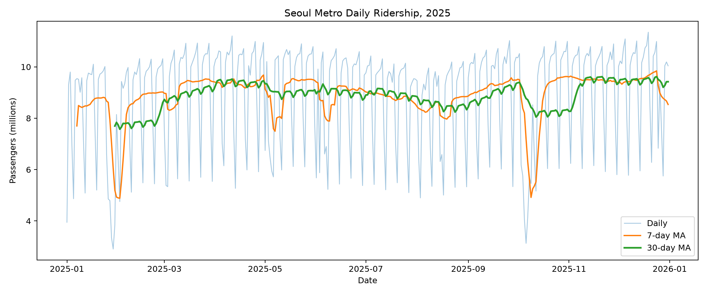
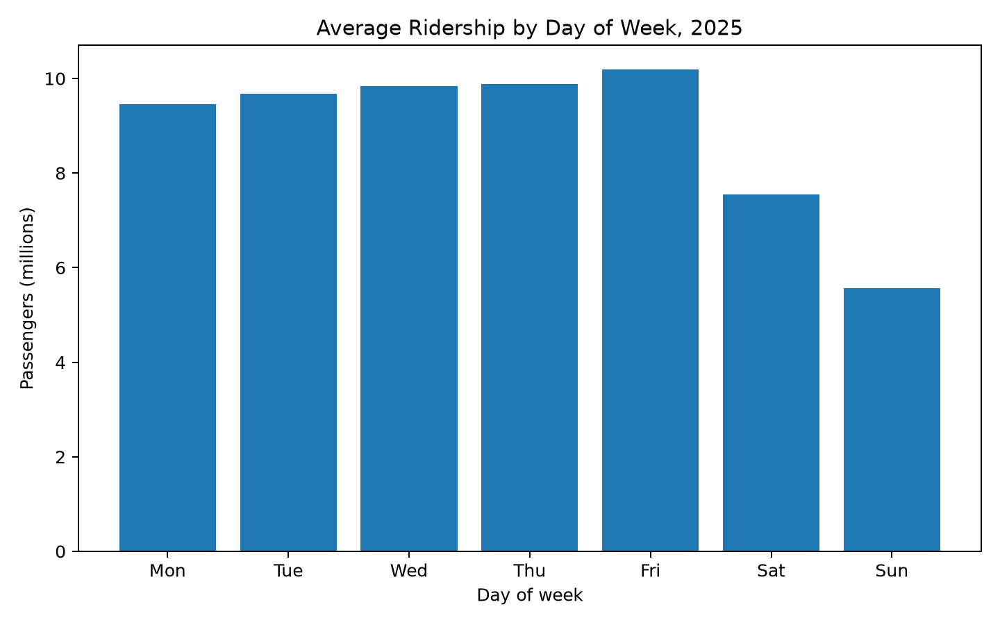
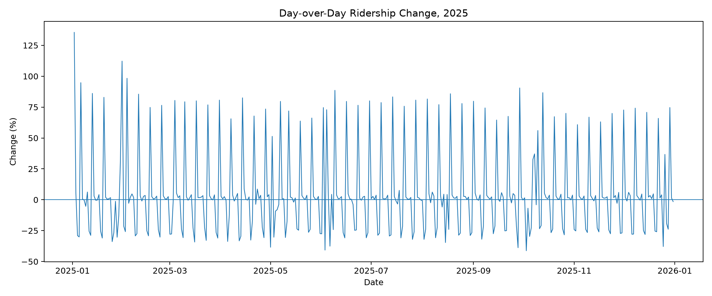
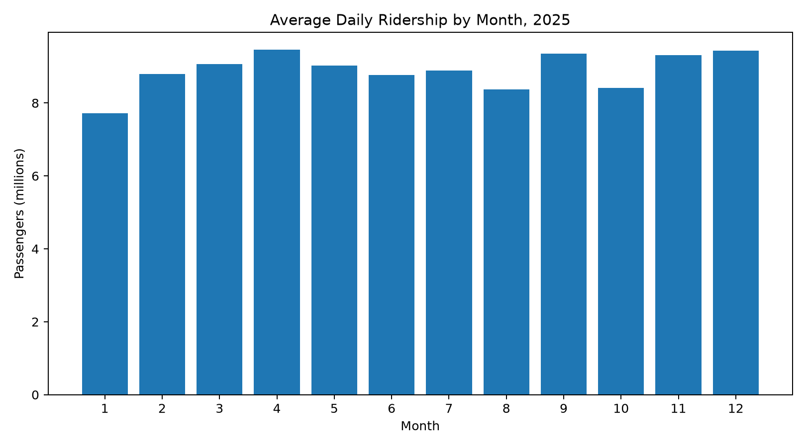

# 2025년 서울 지하철 이용량 시계열 트렌드 분석 리포트

## 1. 분석 주제 및 선정 이유

본 분석은 **서울교통공사 관할 1~8호선의 2025년 일별 총 승하차 이용량**을 대상으로
시간에 따른 추세, 요일별 반복 패턴, 급격한 변화 구간을 분석한다.

지하철 이용량은 도시의 반복적인 이동 활동을 일 단위로 관찰할 수 있으며,
2025년 전체 365일을 이용하면 이동평균, 변화율, 요일/월별 집계 등
기본 시계열 분석 기법을 적용하기 적합하다.

## 2. 분석 질문

1. 2025년 이용량에는 어떤 장·단기 추세가 나타나는가?
2. 평일과 주말 및 각 요일의 평균 이용량은 얼마나 다른가?
3. 전일 대비 이용량이 급격하게 변한 날짜는 언제인가?
4. 월별 평균 이용량에는 어떤 차이가 있는가?

## 3. 데이터 설명

- 데이터셋: 서울교통공사_역별 일별 시간대별 승하차인원 정보
- 공식 출처: 서울 열린데이터광장 `OA-12921`
- 2025 파일명: `서울교통공사_역별 일별 시간대별 승하차인원_20251231.csv`
- 분석 기간: 2025-01-01 ~ 2025-12-31
- 최종 시계열 포인트: 365개
- 분석 범위: 서울교통공사 관할 1~8호선
- 원본 구성: 날짜, 호선, 역번호, 역명, 승하차구분, 시간대별 인원
- 공식 파일 내려받기·실행 확인일: 2026-09-26
- 원본 파일 SHA-256: `99591265DAF498015499F03913CD3253A57C3FF976AE182F9C4AF89FCCA4E5BA`

실제 원본은 199,424행이며, 모든 필드가 빈 행 134개를 제외한 데이터 행은 199,290개다.
2025년 365일 모두 날짜별 273개 역번호에서 승차·하차 각 1행씩 제공되며,
시간대 인원 컬럼은 `06시이전`부터 `24시이후`까지 20개다.

원본 CSV는 공식 페이지의 이용조건을 존중하기 위해 저장소에 재배포하지 않고,
`data/raw/README.md`에 다운로드 경로를 명시했다.
`python scripts/prepare_data.py`를 실행하면 원본에서 일별 총 이용량을 자동 생성한다.

## 4. 데이터 정제

### 4.1 날짜 처리
- 필수 컬럼 `수송일자`, `호선`, `역번호`, `역명`, `승하차구분`과 20개 시간대 컬럼을 확인한다.
- 원본의 완전 빈 행 134개만 제외하고 `수송일자`를 datetime으로 변환한다.
- 2025-01-01부터 2025-12-31까지 365개 날짜가 빠짐없이 있는지 검사하고 날짜순으로 정렬한다.

### 4.2 승객 수 집계
- 원본의 `06시이전`부터 `24시이후`까지 20개 시간대 인원을 정수로 검증한 뒤 합산한다.
- 날짜별로 모든 역과 승차/하차 행을 다시 합산하여 `passengers`를 생성한다.
- 날짜·호선·역번호·승하차구분의 중복, 날짜별 역번호 누락, 승차 또는 하차 행 누락을 검사한다.

### 4.3 결측치와 이상치
- 날짜 변환 실패, 일부 필드만 빈 데이터 행, 숫자 변환 실패·음수·소수 인원을 오류로 처리한다. 결측 승객 수를 0으로 대체하지 않는다.
- 일별 총 이용량이 0 이하인지 검사한다.
- 공휴일·연휴 등으로 인한 극단값은 실제 현상일 가능성이 있으므로 자동 삭제하지 않는다.
- 파생 변수 `ma7`의 첫 6일, `ma30`의 첫 29일, `change_rate_pct`의 첫 1일은 계산 기준일이 부족해 비어 있다. 원본 결측과 구분한다.

## 5. 적용한 시계열 분석 기법

1. **7일 이동평균** — 주 단위 반복 변동을 완화해 단기 추세를 확인
2. **30일 이동평균** — 월 수준의 기저 흐름 확인
3. **전일 대비 변화율** — 급격한 변화 날짜 탐색
4. **요일별 평균** — 주간 계절성 확인
5. **월별 평균** — 월 단위 패턴 비교

## 6. 분석 결과 및 시각화

### 6.1 일별 이용량과 이동평균



**관찰(Fact)**

- 연간 일평균 이용량은 약 **8,881,270명**이다.
- 중앙값은 약 **9,831,144명**이다.
- 365일 전체를 모집단으로 계산한 일별 이용량의 표준편차(`ddof=0`)는 약 **1,975,065명**이다.
- 최대 이용량은 **2025-12-19 11,349,481명**이다.
- 최소 이용량은 **2025-01-29 2,907,370명**이다.
- 원시 일별 값은 큰 폭으로 반복 변동하지만 7일/30일 이동평균은 더 완만하게 움직인다.
- 30일 이동평균의 최솟값은 **2025-02-02 약 7,572,903명**, 최댓값은 **2025-12-24 약 9,620,978명**이다.

**해석(가설)**

일별 수치에는 평일/주말 반복 주기와 공휴일·연휴 등 달력 효과가 포함되어 있을 가능성이 있다.
따라서 장기 추세를 판단할 때 단일 날짜 값보다 이동평균을 함께 보는 편이 적절하다.

---

### 6.2 요일별 평균 이용량



| 요일 | 평균 이용량 |
|---|---:|
| Mon | 9,453,614명 |
| Tue | 9,672,598명 |
| Wed | 9,836,882명 |
| Thu | 9,882,744명 |
| Fri | 10,189,947명 |
| Sat | 7,549,139명 |
| Sun | 5,565,590명 |

**관찰(Fact)**

- 평일 평균 이용량은 약 **9,807,271명**이다.
- 주말 평균 이용량은 약 **6,557,365명**이다.
- 평일 평균은 주말보다 약 **49.6%** 높다.

**해석(가설)**

서울 지하철 수요에는 통근·통학 등 평일 반복 활동의 영향이 강하게 반영된 것으로 해석할 수 있다.
그러나 집계 데이터만으로 개별 승객의 이동 목적을 직접 확인할 수는 없다.

---

### 6.3 전일 대비 변화율



절대 변화율이 큰 날짜 일부:

- 2025-01-02: +135.5% (9,300,390명)
- 2025-01-31: +112.2% (8,144,419명)
- 2025-02-03: +98.3% (9,430,732명)
- 2025-01-06: +94.8% (9,478,276명)
- 2025-09-29: +90.5% (10,166,966명)

**관찰(Fact)**

일부 날짜 전후에는 다른 날보다 훨씬 큰 폭의 증감이 나타난다.

**해석(가설)**

이러한 변화는 공휴일, 연휴, 날씨, 대형 행사 또는 운영 이슈와 관련될 가능성이 있다.
다만 본 데이터에는 외부 사건 변수가 포함되어 있지 않으므로 원인을 확정할 수 없다.

**추가 분석**

공휴일 캘린더, 서울 기상 데이터, 주요 행사 일정 등을 날짜 기준으로 결합하면
급격한 변동 원인에 대한 가설을 추가 검증할 수 있다.

---

### 6.4 월별 평균 이용량



**관찰(Fact)**

- 월별 일평균 이용량이 가장 높은 달은 **4월 9,460,110명**이다.
- 가장 낮은 달은 **1월 7,712,039명**이다.

**해석(가설)**

월별 차이는 계절 자체뿐 아니라 공휴일 수, 평일 수, 방학, 행사 등의 영향을 함께 받을 수 있다.
따라서 단순히 특정 계절이 원인이라고 단정해서는 안 된다.

## 7. 핵심 인사이트

### Insight 1. 주간 계절성이 뚜렷하다

- **관찰:** 평일 평균 약 9,807,271명, 주말 평균 약 6,557,365명으로 평일이 약 49.6% 높다.
- **해석:** 주중 반복 이동 수요가 전체 이용량에 큰 영향을 미칠 가능성이 있다.
- **Action:** 향후 수요 예측 모델에서는 `요일`을 핵심 설명 변수로 포함해야 한다.

### Insight 2. 장기 흐름은 이동평균으로 보는 편이 안정적이다

- **관찰:** 일별 이용량의 모집단 표준편차는 약 1,975,065명이며, 30일 이동평균은 2025-02-02 약 7,572,903명에서 2025-12-24 약 9,620,978명까지 범위가 확인된다.
- **해석:** 원시 하루 값만으로 추세를 판단하면 주말·연휴 효과를 장기 추세로 오인할 수 있다.
- **Action:** 운영·수요 판단 시 7일 및 30일 이동평균을 원시 데이터와 함께 확인한다.

### Insight 3. 극단값은 삭제보다 조사 대상으로 보는 편이 적절하다

- **관찰:** 특정 날짜에서 전일 대비 큰 폭의 증가·감소가 관찰된다.
- **해석:** 시계열의 극단값은 데이터 오류가 아니라 실제 외부 사건의 신호일 수 있다.
- **Action:** 이상값을 자동 제거하지 않고 공휴일·기상·행사 데이터와 결합해 검증한다.

## 8. 결론

2025년 서울 지하철 이용량에서는 단순한 선형 상승·하락보다
**요일별 반복 패턴과 특정 날짜의 급격한 변동**이 더 명확하게 나타난다.

따라서 도시철도 수요를 해석할 때는 일별 원시값만 보는 것보다
이동평균, 변화율, 요일별·월별 집계를 함께 사용하는 것이 적절하다.

특히 평일/주말 차이는 명확하지만,
그 원인을 통근·통학 등 특정 활동으로 확정하려면 추가적인 외부 데이터가 필요하다.

## 9. 한계점

1. 서울교통공사 관할 1~8호선 데이터이므로 수도권 전체 철도 이용량을 대표하지 않는다.
2. 일별 총량으로 집계하여 역별·시간대별 차이가 합쳐져 있다.
3. 날씨, 공휴일, 행사, 운영 이슈 등의 외부 변수를 직접 포함하지 않았다.
4. 관찰 데이터이므로 특정 사건과 이용량 변화 사이의 인과관계를 단정할 수 없다.
5. 공식 원본의 라이선스 조건 때문에 원본/가공 CSV는 저장소에 직접 재배포하지 않고 재현 절차를 제공한다.

## 10. AI 사용 로그

### 사용 작업
- 분석 주제 및 질문 구조화
- 공식 데이터 출처와 메타데이터 조사
- 원본 컬럼 구조에 맞춘 전처리 코드 작성
- 이동평균, 변화율, 요일/월별 집계 코드 작성
- 시각화 코드 작성
- 관찰(Fact)과 해석(가설)을 구분한 리포트 작성
- Streamlit 대시보드 작성

### 사용 이유
반복적인 코드 작성 시간을 줄이고,
과제 요구사항을 빠짐없이 구조화하며,
분석 방법의 대안을 비교하기 위해 AI를 활용했다.

### 검증 방법
1. 서울 열린데이터광장 공식 페이지의 2025 파일명·관할 범위·공공누리 3유형 표시와 내려받은 CSV 헤더를 대조
2. 완전 빈 행 134개를 구분하고 2025년 365일, 매일 273개 역번호의 승차·하차 쌍과 20개 시간대 값을 검사
3. 결측치, 숫자 변환 실패, 음수, 중복 키, 0 이하 일별 합계를 코드로 검증
4. 원본에서 독립 집계한 일평균·평일/주말 평균·최대/최소·요일별·월별 평균과 코드 결과를 대조
5. 새 가상환경에서 전체 파이프라인과 노트북을 실행하고 이미지 링크와 대시보드 시작을 확인
6. 외부 원인은 데이터로 직접 입증되지 않는 한 '가설'로만 작성

## 11. 재현 방법

```bash
pip install -r requirements.txt
python scripts/prepare_data.py
python scripts/analyze.py
jupyter notebook analysis.ipynb
```

또는:

```bash
python run_all.py
```

보너스 대시보드:

```bash
streamlit run app.py
```
